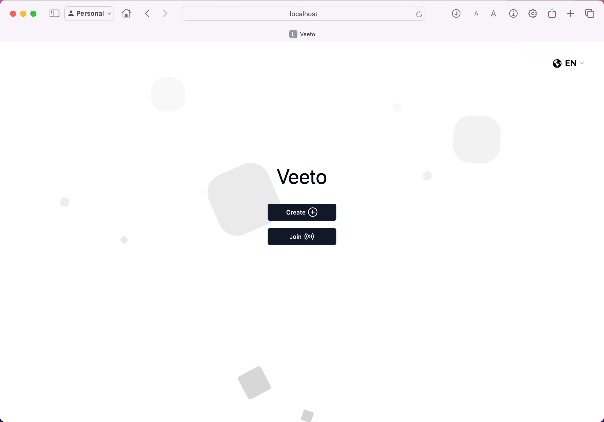

<p align="center">
    <h1 align="center" style="font-family: 'Poppins', sans-serif; text-shadow: 2px 2px 2px rgba(0, 0, 0, 0.5);">Veeto</h1>
    <br>
</p>

## Background
Veeto was inspired by the many occurrences where my partner and I struggled to decide where to eat, 
often spending more time second-guessing our options than enjoying a meal. 
Our indecisiveness led me to create a solution—a website designed to help simplify the decision-making process. 
Unlike existing tools that merely list nearby restaurants, Veeto takes user preferences into account to make a tailored recommendation. 
My goal is for others who face the same dilemma to find this platform just as helpful.

## Tech Stack
> Javascript | 
> React | 
> Express

## Directory Structure 
    client/                contains all files for frontend
        src/               contains all source files
            assets/        contains images i.e avatar pfp
            components/    contains components from shadcn, aceternity, etc 
            lib/           contains util.js used for tailwind css
            pages/         contains the pages of the website 
    server/                contains all files for backend
        index.js           backend file for business logic

## Installation
You can install the project using the following command
```
git clone https://github.com/c-lorenzo76/Veeto.git
```

## Start the server
In terminal run the commands to start the server, 
and it will run on localhost:8000
```
cd server
npm i 
npm start
```

## Start the client
The open another terminal, navigate to client folder and run the following commands,
it will run on localhost:5173
```
cd client
npm i
npm run dev
```

## Landing Page



### Updates
09/13 <br>
I followed on the approach of having 'lobbyInfo' to be able to update 'users'. 
Then that's how I kept track of the users connected since I would just use 
'users.length'. Then I added the 'userDisconnect' from 'Lobby.jsx' for when
a user disconnects from the socket. I've also managed to pull the information
for 'vote' on the backend via the parameters, so I can manage to move onto voting.
The thing I can see that I would struggle would be keeping track of everyone in the
'users' that have voted to then proceed to the next question. Once I get the question
tracking working I should focus on the progress bar as well. Then in the meantime while
I figure out how to make it display the searches based on the results. Oh, btw
check how to fix the error that I still keep getting in the 'Lobby.jsx'. Then
also view how to make not many socket requests only when needed. The 'lobbyInfo' 
for example makes a lot of rq when just one person is in the lobby. On a larger scale
this could make it expensive especially on the cloud. 


09/09 <br>
I still have to finish the Questions.jsx with the voting feature. 
Found a temp solution to the player count but has problems when
a user disconnects as it does not update. Did a minor 
change to use the disconnect that is already in index.js but for 
some reason it would also pass onto the lobby.jsx so it would remove it twice? Was acting off. 
Might have to make two different disconnects?? I think i just need a better way of checking for user count,
maybe actually store all the users and then just use length similar to lobbyinfo. 
I need to also adjust the Lobby.jsx sockets or just the sockets in general. 
Figure out how to have it run only when required I have that shit constantly 
emitting. Still continuing to have teh issue in Lobby.jsx with that long error check 
if motion has anything to do with it. START TO PUT IT ONTO A SERVER BY END OF WEAK PLEASE. 

09/04 <br>
I fixed the issue of only the host being redirected to Questions page. I now need to add the voting
implementation. After I need to adjust it to become a multi step form. Once those two things are in play 
I can make it show the results from the poll. Have it display places to eat according to the responses 
May need to create a new Google account to be able to make requests based off coordinates or see other 
API uses. Maybe don't even need that an could use TripAdvisor API.
Warning: Each child in a list should have a unique "key" prop.

error for something idk what

Check the render method of `Lobby`. See https://reactjs.org/link/warning-keys for more information.
MotionComponent@http://localhost:5173/node_modules/.vite/deps/framer-motion.js:475:40
Lobby@http://localhost:5173/src/pages/Lobby.jsx:27:31
SocketProvider@http://localhost:5173/src/SocketContext.jsx:22:5
RenderedRoute@http://localhost:5173/node_modules/.vite/deps/react-router-dom.js:4011:32
Routes@http://localhost:5173/node_modules/.vite/deps/react-router-dom.js:4444:19
UserProvider@http://localhost:5173/src/UserContext.jsx:26:6
Router@http://localhost:5173/node_modules/.vite/deps/react-router-dom.js:4387:28
BrowserRouter@http://localhost:5173/node_modules/.vite/deps/react-router-dom.js:5132:26
App

08/30 <br>
Okay I believe I fixed the issue with navigating and maintaining the connection of the socket. Had some issues resolving that but now I am able to continue 
to navigate without any hiccups. I might have to refactor my code as its all over the place. I also have lots of unnecessary
functions and emit that don't amount to nothing. So before we work on Questions.jsx tomorrow. I'll fix those issues first. 

08/28 <br>
Currently it is somewhat working. 
Having issues with navigating. 
When I start the game from Lobby and it navigates I lose connection of the socket and therefore deletes lobbies[code]. 
Need to figure out how to maintain that when navigating might have to resolve by rewriting useSocket and UserContext. 


